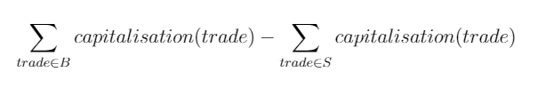

# Project description

This project represents a managing application targeting as user a broker responsible for managing trades of multiple clients.

The application contains a client and a server which is exposing different services.

## Client

The client is using difference services exposed by the server to construct different views. One of these views is showing all the trades that exist in the system.

Example:

```
| Client Id  | Instrument |     Side |    Price |      Qty| Asset class|
| jon        | XPAR;FTE   |      BUY |       10 |        3|      OPTION|
| mary       | XLON;GOOG  |      BUY |       10 |        2|      EQUITY|
| jon        | XLON;GOOG  |      BUY |       10 |       20|      EQUITY|
| ana        | XLON;AAPL  |     SELL |       10 |       20|        BOND|
| jon        | XLON;GOOG  |     SELL |       10 |       20|    STRATEGY|
| jon        | XLON;GOOG  |     SELL |       11 |       20|      EQUITY|
```

Beside viewing the trades, the user has the option to see the capitalisation for a certain client. 

Example: 

```
Client jon has capitalization = 3420
```

## Server

The server part of the application is exposing 2 services which are used by the client to obtain the discussed views. 
The services exposed by the server are: 
 - *TradeProviderService* : provider of all the trades that exist in the system
 - *ClientCapitalisationService*: provider of the current capitalisation of a certain client

### Capitalisation computation
For implementing the service ClientCapitalisationService the server follows the algorithm:
 - capitalisation of a client represents the sum of the capitalisation of all the trades of that client
 - capitalisation of a trade depends on the type of the trade (asset class):
```
        | Asset class |Capitalization Formula|
        | EQUITY      | price * qty          |
        | BOND        | price * qty          |
        | OPTION      | price * qty * 100    |
        | STRATEGY    | 0                    |
```
        
Example of computing the capitalization for client 'jon' using the trades provided as example above:
- trades of the client:
```
| jon        | XPAR;FTE   |      BUY |       10 |        3|      OPTION|    ----> trade capitalisation = 3000
| jon        | XLON;GOOG  |      BUY |       10 |       20|      EQUITY|    ----> trade capitalisation = 200
| jon        | XLON;GOOG  |     SELL |       10 |       20|    STRATEGY|    ----> trade capitalisation = 0
| jon        | XLON;GOOG  |     SELL |       11 |       20|      EQUITY|    ----> trade capitalisation = 220
``` 
- client total capitalisation = 3420
                                                       
# Running the app
Run the `main` method of TradingClient. 

# Existing issues
The current service for computing the capitalisation contains a bug. 

## Bug description:
Current behavior: the capitalisation of client `jon` is `720`
Expected behavior:the capitalisation of client `jon` should be `3420`
    Explanation:
- trades of the client `jon` are:
```
| jon        | XPAR;FTE   |      BUY |       10 |        3|      OPTION|    ----> trade capitalisation = 3000
| jon        | XLON;GOOG  |      BUY |       10 |       20|      EQUITY|    ----> trade capitalisation = 200
| jon        | XLON;GOOG  |     SELL |       10 |       20|    STRATEGY|    ----> trade capitalisation = 0
| jon        | XLON;GOOG  |     SELL |       11 |       20|      EQUITY|    ----> trade capitalisation = 220
``` 
- client `jon` capitalisation = 3000 + 200 + 0 + 220 = 3420

## Hint:
There are also some unit tests covering this scenario. 

# New functionalities

## Portfolio value computation
Another view that it would be needed is the portfolio value of a client. 

The formula for computing the exposure of a client is:



where B represents the list of all BUY trades of a client and S represents the list of all the SELL trades of the client

___Note___: the capitalisation of a trade is computed as explained in [Capitalisation computation section](#capitalisation-computation) 

## Portfolio value is within defined limits

Sometimes there is the need to limit clients to not trade too much in order to avoid risks. 
Improve the application to show if the portfolio value of a client is within limits.  